<picture>
  <source media="(max-width: 600px)" srcset="assets/mobile/header.svg">
  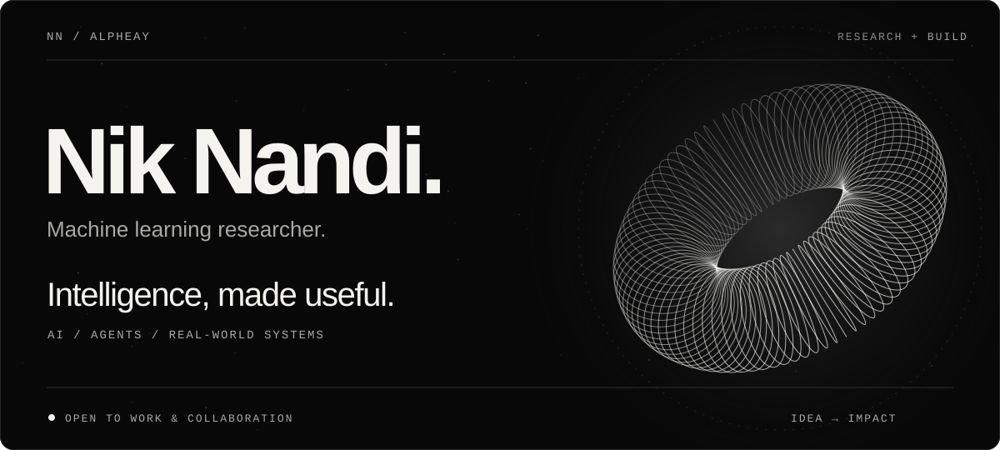
</picture>

  <a href="#projects">Projects</a> &nbsp; / &nbsp;
  <a href="#tech-stack">Stack</a> &nbsp; / &nbsp;
  <a href="#contact">Contact</a>

 

<picture>
  <source media="(max-width: 600px)" srcset="assets/mobile/hero_animation.svg">
  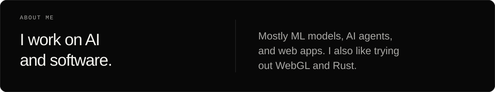
</picture>

 

## Projects

A few things I've worked on. Some are research projects, some are tools and apps.

<a href="https://github.com/gtfintechlab/IPO-Mine">
  <picture>
    <source media="(max-width: 600px)" srcset="assets/featured/mobile/ipo_mine.svg">
    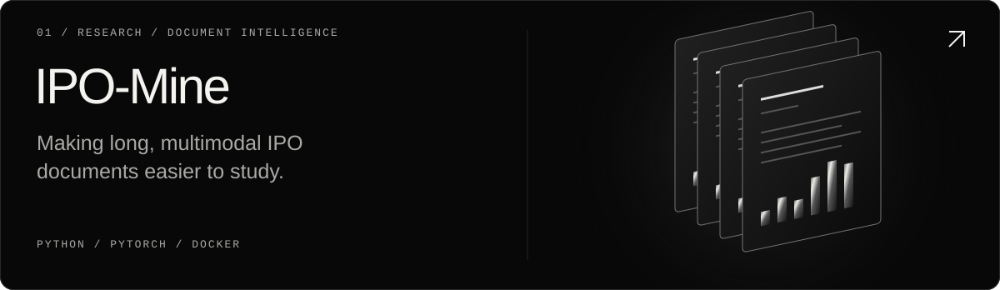
  </picture>
</a>

[Code ↗](https://github.com/gtfintechlab/IPO-Mine) &nbsp; · &nbsp; [Project site](https://ipo-mine-website.pages.dev/)

 

<a href="https://github.com/alpheay/jec">
  <picture>
    <source media="(max-width: 600px)" srcset="assets/featured/mobile/jec.svg">
    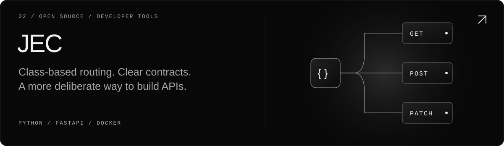
  </picture>
</a>

[Code ↗](https://github.com/alpheay/jec) &nbsp; · &nbsp; [Documentation](https://alpheay.github.io/jec/)

 

<a href="http://hyperbleed.me/">
  <picture>
    <source media="(max-width: 600px)" srcset="assets/featured/mobile/hyperbleed.svg">
    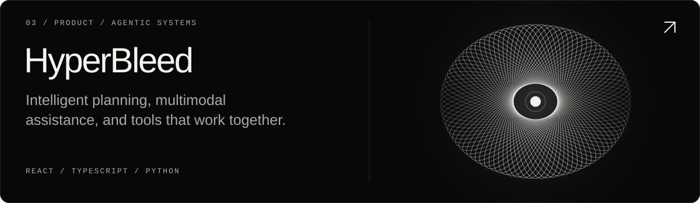
  </picture>
</a>

[Visit HyperBleed ↗](http://hyperbleed.me/) &nbsp; · &nbsp; [Changelog](http://hyperbleed.me/changelog)

 

<a href="https://www.venehealth.com/">
  <picture>
    <source media="(max-width: 600px)" srcset="assets/featured/mobile/vene.svg">
    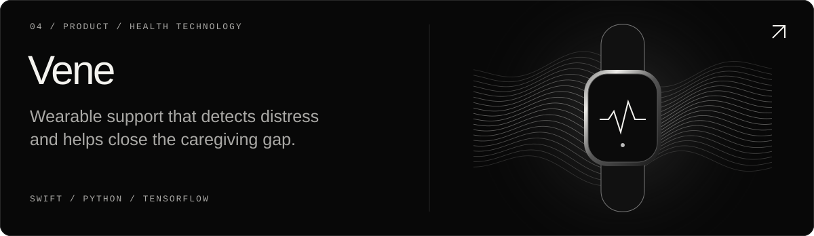
  </picture>
</a>

[Visit Vene ↗](https://www.venehealth.com/)

 

<a href="https://github.com/alpheay/glycerin">
  <picture>
    <source media="(max-width: 600px)" srcset="assets/featured/mobile/glycerin.svg">
    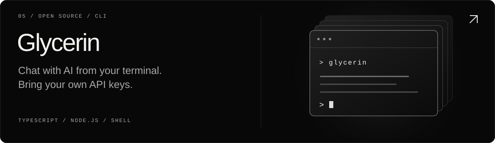
  </picture>
</a>

[Code ↗](https://github.com/alpheay/glycerin)

 

<a href="https://github.com/alpheay/portfolio">
  <picture>
    <source media="(max-width: 600px)" srcset="assets/featured/mobile/portfolio.svg">
    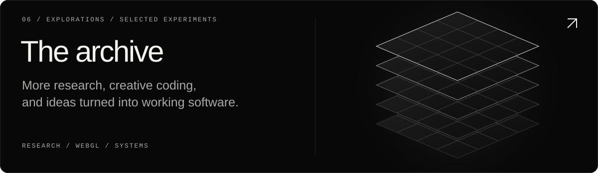
  </picture>
</a>

[More projects ↗](https://github.com/alpheay/portfolio) &nbsp; · &nbsp; [All repositories](https://github.com/alpheay?tab=repositories)

 

## Tech stack

Languages and tools I use.

<picture>
  <source media="(max-width: 600px)" srcset="assets/mobile/stack.svg">
  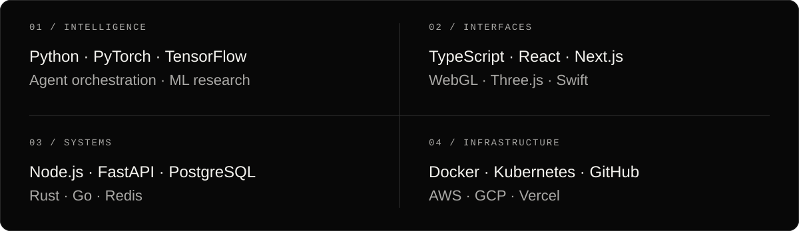
</picture>

 

## Contact

<a href="mailto:nik.nandi.1@gmail.com">
  <picture>
    <source media="(max-width: 600px)" srcset="assets/mobile/connect_animation.svg">
    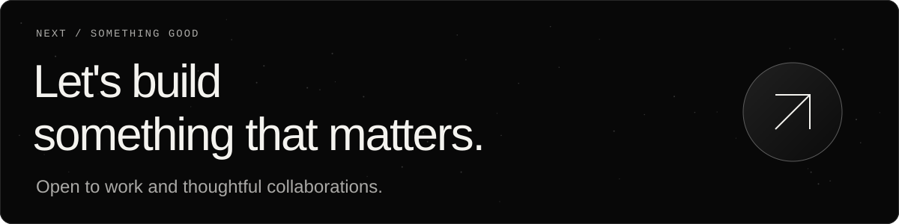
  </picture>
</a>

  <a href="mailto:nik.nandi.1@gmail.com">Email ↗</a> &nbsp; / &nbsp;
  <a href="https://www.linkedin.com/in/niknandi/">LinkedIn ↗</a> &nbsp; / &nbsp;
  <a href="https://x.com/NikNandi">X ↗</a>

 

  
GitHub activity

   
  <picture>
    <source media="(prefers-color-scheme: dark)" srcset="https://raw.githubusercontent.com/alpheay/alpheay/output/github-contribution-grid-snake-dark.svg">
    
  </picture>
  
<a href="https://github.com/alpheay?tab=overview">View activity on GitHub ↗</a>

 

<picture>
  <source media="(max-width: 600px)" srcset="assets/mobile/footer.svg">
  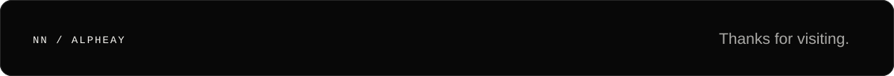
</picture>
